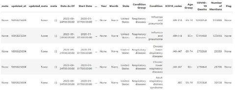
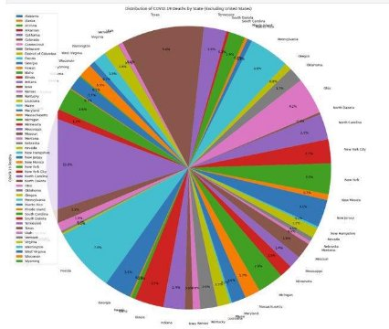
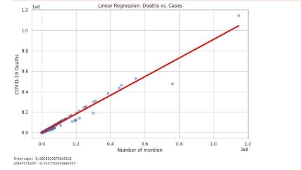
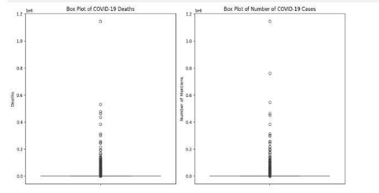
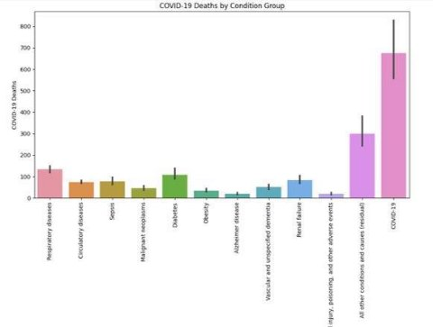

`            `**Strategic Data Insights on COVID-19 Impact Analysis                                Final Project Report** 

 

**Shubham Shekhar Patil**  

**Source Description: CDC's Public Health Database** 

**Overview** 

The data for this project was sourced from a public health database provided by the Centers for Disease Control and Prevention (CDC). The CDC is a leading national public health institute in the United States and offers a wide range of health-related datasets. These datasets are critical for research and analysis in the field of public health and epidemiology. The CDC database is a valuable resource for accessing up-to-date and comprehensive health data. 

URL of the CDC Dataset:[ CDC COVID-19 Data ](https://data.cdc.gov/api/views/hk9y-quqm/rows.json?accessType=DOWNLOAD)

**Objectives** 

**Visualization for Communication:**  

- Use visualizations (such as histograms, line plots, and heatmaps) to effectively communicate trends and patterns to a diverse audience, making the analysis accessible and informative.  

**Predictive Modeling**  

- Implement predictive models into our analysis and forecast future trends in COVID-19 deaths based on historical data.  

**Comparative Analysis:**  

- Compare COVID-19 death rates across different health conditions, states, or demographics to draw insights into the effectiveness of public health measures and healthcare systems.  

**Understanding the Impact:**  

- Analyze the overall impact of COVID-19 on mortality rates, identifying trends and patterns in the number of deaths over the pandemic.  

**Geospatial Analysis:**  

- Explore geographic variations in COVID-19 deaths, examining how different states have been affected using heatmaps  

**Demographic Patterns:**  

- Investigate demographic factors such as age and underlying health conditions to understand how different populations are affected by COVID-19  

**Data Content** 

The dataset appears to be focused on health-related statistics, specifically around respiratory diseases, with a significant emphasis on COVID-19. Key attributes of the dataset include: 

1. **sid**: A unique identifier for each row in the dataset. 
1. **id**: Another unique identifier, possibly for tracking purposes. 
1. **position**: Position index of the record. 
1. **created\_at**: Timestamp indicating when the record was created. 
5. **updated\_at**: Timestamp indicating when the record was last updated. 
5. **Data As Of**: The date until which the data is relevant. 
5. **Start Date and End Date**: The time range for the data collection. 
5. **Year and Month**: Year and month of the data record. 
5. **State**: The U.S. state to which the data pertains. 
5. **Condition Group**: The category of the condition, such as 'Respiratory diseases'. 
5. **Condition**: Specific condition, e.g., 'Influenza and pneumonia'. 
5. **ICD10\_codes**: The International Classification of Diseases 10th Revision (ICD-10) codes for the conditions. 
5. **Age Group**: The age range of the individuals affected. 
5. **COVID-19 Deaths**: The number of deaths attributed to COVID-19. 
5. **Number of Mentions**: The frequency of mentions of the condition. 
5. **Flag**: Possibly indicating special cases or notes in the data. 

**Data Retrieval and Processing** 

1. **Retrieval Method**: 
- A web request was made to the CDC's API using the **requests** library in Python. The target URL for the request was[` `**https://data.cdc.gov/api/views/hk9y- quqm/rows.json?accessType=DOWNLOAD**.](https://data.cdc.gov/api/views/hk9y-quqm/rows.json?accessType=DOWNLOAD) 
2. **Parsing the JSON Response**: 
- The data, received in JSON format from the API, was parsed to extract the relevant information. This step is crucial for transforming the data into a structured format suitable for analysis. 
3. **DataFrame Creation**: 
- Using the pandas library, a DataFrame (**df**) was created. The columns of this DataFrame were dynamically named based on the 'name' attribute of the columns in the JSON metadata. This process ensures that the DataFrame accurately represents the structure and attributes of the original dataset. 
4. **Initial Data Overview**: 
- The resulting DataFrame provides a comprehensive view of various health-related attributes, including demographic details and specific statistics pertinent to public 

  health studies. 

This description effectively outlines the source and methodology of data acquisition from the CDC, framing the context for the subsequent data analysis in your project report. 

**Preprocessing Steps** 

1. **Importing Necessary Libraries**: 
- Libraries such as pandas, matplotlib.pyplot, numpy, and seaborn are imported. These are essential for data manipulation, analysis, and visualization. 
2. **Reading Data Files**: 
- Multiple CSV files representing YouTube trending video data from various countries (Brazil, Canada, France, Germany, India, Japan, Korea, Mexico, Russia, UK, and USA) are read into separate pandas DataFrames. 
3. **Adding Country Information**: 
- A new column **country** is added to each DataFrame, labeling each row with its respective country. This step aids in easy identification of the country of origin for 

  each video. 

4. **Data Inspection**: 
- A brief inspection of one of the DataFrames (df11, representing USA data) using the **.head()** function, a standard practice to ensure correct data loading and to understand its structure. 
5. **Combining Datasets**: 
- All the individual DataFrames are concatenated into a single DataFrame using **pd.concat**. This merged DataFrame now contains trending video data from all the 

  countries. 

**Why is Preprocessing Necessary?** 

- **Data Integration**: Merging data from various sources creates a comprehensive dataset suitable for extensive analysis. 
- **Enhancing Data Quality**: Inspecting and adding necessary information, like country labels, enhances the data quality, making it more informative and easier to work with. 
- **Cleansing/Purging**: Cleaning the data ensures data integrity and accuracy, which is critical for reliable analyses. 
- **Aggregation/Summarization**: Provides insights into broader trends and patterns that might not be visible at the individual data level. 
- **Combining Data Sets**: Enables a holistic view of data collected from multiple sources, helping to understand global trends in YouTube video popularity and comparing trends across different countries. 

**Data Cleaning Steps** 

1. **Converting Data Types**: 
- The 'Year' and 'Month' columns are converted to numeric types using **pd.to\_numeric**. This ensures that these columns are treated as quantitative data, which is essential for any time-series analysis or when these attributes are used in calculations. 
2. **Renaming Columns**: 
- The 'COVID-19 Deaths' column is renamed to 'Deaths' for simplicity and ease of reference in the analysis. 
3. **Numeric Conversion with Error Coercion**: 
- Both 'Deaths' (formerly 'COVID-19 Deaths') and 'Number of Mentions' columns are converted to numeric types. Using **errors='coerce'** ensures that any non- numeric values are set as NaN (Not a Number), which aids in maintaining data consistency. 
4. **Parsing Dates**: 
- The 'Data As Of', 'Start Date', and 'End Date' columns are parsed into datetime objects using **pd.to\_datetime**. This conversion is crucial for any temporal analysis, as it allows for proper sorting, filtering, and time-based aggregations. 
5. **Dropping Null Columns**: 
- Columns 'created\_meta' and 'updated\_meta', which contain all null values, are dropped. Removing such columns helps in focusing on relevant data and reduces 

  memory usage. 

6. **Removing Unnecessary Columns**: 
- Additional columns like 'id', 'meta', and 'position', not needed for analysis, are dropped. This step simplifies the dataset, making it more manageable. 
7. **Normalizing Text Data**: 
- The text data in 'Condition', 'Condition Group', and 'State' columns are normalized: 'Condition' and 'Condition Group' are converted to lowercase, and 'State' is converted to title case. This normalization ensures consistency in text data, which is particularly important for categorical analysis and when merging data from different sources. 
8. **Handling Missing Data**: 
- Missing values in the 'Year' column are filled with the mode (most frequent value). This approach provides a reasonable estimate for missing data without significantly skewing the dataset. 
- Rows with NaN values in the 'Deaths' column are dropped. Since 'Deaths' is a key variable for analysis, having accurate and complete data in this column is critical. 
9. **Removing Duplicates**: 
- Duplicate rows are removed from the dataset. This step is essential to prevent skewed results caused by redundant data 

**Methods of Analysis** 

**Questions to be Answered** 

The analysis aims to explore various aspects of COVID-19 related data, including age, condition groups, mortality rates, and trends over time. Key questions include: 

- How do COVID-19 deaths vary across different age groups? 
- What is the distribution of COVID-19 deaths across various months and years? 
- Which condition groups have the highest mortality rates due to COVID-19? 
- Is there a linear relationship between the number of mentions and COVID-19 deaths? 
- How do COVID-19 deaths and cases differ among various states and conditions? 

**Fields Used in the Data** 

The analysis utilizes several key fields from the dataset, including: 

- **Age Group**: To analyze the impact of COVID-19 across different age demographics. 
- **Month** and **Year**: To observe temporal trends in COVID-19 related data. 
- **Condition Group**: For identifying the groups most affected by COVID-19. 
- **Deaths**: The primary measure for COVID-19 impact analysis. 
- **Number of Mentions**: Used as an indicator of the prevalence or reporting frequency of COVID-19 cases. 

**Methods of Collating Results** 

- **Grouping and Summarization**: Data is grouped by relevant categories (like 'Age Group', 'Month', 'Year', 'Condition Group') and summarized (e.g., sum of 'Deaths') to extract meaningful patterns. 
- **Data Visualization**: Various types of plots, including bar plots, histograms, scatter plots, and line plots, are used to visually represent the data, aiding in the interpretation of the trends and patterns. 
- **Statistical Analysis**: 
- Linear regression is performed to understand the relationship between 'Number of Mentions' and 'Deaths'. 
- Multiple regression analysis is conducted to assess the combined impact of 'Condition Group' and 'Age Group' on 'Deaths'. 
- One-way ANOVA is used to compare COVID-19 deaths among different condition groups. 
- **Cluster Analysis**: K-means clustering is applied to understand how states cluster based on 'Deaths' and 'Number of Mentions'. 
- **Geospatial Analysis**: A choropleth map is created to visualize the geographic distribution of COVID-19 deaths across US states.** 

**Documentation of Output** 

A scatter plot for Deaths Vs Number of cases to understand the relationship between these variables 

A stripp plot to understand how age group factor has an impact on Covid 19 deaths 

**Age Filtering** 

Performed filtering on the Age group variable

**Pie Chart & Bar Chart Analysis** 

Pie chart and bar graph shows the distribution of Deaths by states 

The data suggests that the impact of COVID-19 on mortality rates increases with age, with the highest number of deaths occurring in the oldest age bracket. 

**Analysis of Variables: Bar Charts** 

The stacked bar chart presents the mortality rate of patients with COVID-19 in conjunction with various underlying health conditions or comorbidities. The length of each bar represents the percentage of the mortality rate attributed to each condition group, providing insight into which health issues are most commonly associated with fatal COVID-19 outcomes. 

The distribution of COVID-19 deaths across different months. The x-axis represents the months, and the y-axis represents the frequency of deaths.

**Histogram Analysis** 

Overview of the distribution of deaths across different years

**Linear Regression** 

Predictive model that showcases how deaths and mentions are closely related to the data's average. As deaths increase, the number of mentions increases (and vice versa), creating a positive linear regression line

**Grouping Data** 

**Counted Condition Group** 

Grouping data by 'Condition Group' and counting the occurrences of each group 

**Number of Deaths by State** 

Grouping data by 'State' and calculating total COVID-19 deaths per state 

**Number of Mentions Per Age Group** 

Grouping data by 'Age Group' and calculating average number of mentions per age group 

**Outlier Analysis: Box Plot**

Both COVID-19 deaths and cases have a skewed distribution with most data points concentrated at the lower end.The median values are closer to the bottom of the data range, indicating a lower central tendency for both deaths and cases. There are numerous outliers for both deaths and cases, signifying instances of very high numbers that deviate from the typical values 

**Hypothesis Testing & Frequency Distribution** 

Comparing the COVID-19 deaths to condition variable in the dataset. The ANOVA results show a high F-statistic of approximately 53.98 and a very low p-value (around 3.49×10−2373.49×10−237). This indicates a statistically significant difference in COVID-19 deaths across different condition groups in our dataset, allowing to reject the null hypothesis that there is no difference between group means. In the Frequency Distribution, the bar chart displays the top 10 conditions associated with COVID-19 deaths, with "Pneumonia" accounting for the highest number of deaths, followed by and "Influenza". 

Analysis: Plot Organized by Condition Group 

Demonstrates COVID-19 fatalities by comorbid conditions.

**Analysis of Washington State **

**First Plot: COVID-19 Deaths by Condition in Washington State** 

This bar chart provides an in-depth look at the comorbidities or underlying conditions associated with COVID-19 fatalities in Washington State. 

**Second Plot: COVID-19 Deaths by Age Group in Washington State** 

- This histogram breaks down the total number of COVID-19 deaths by age group within the state, offering a clear demographic perspective. 

**Cluster Analysis**  

The scatter plot displays a comparison of the top five states by COVID-19 deaths against the number of times COVID-19 is mentioned in official records.

**Heatmap** 

This map visualizes the intensity of COVID-19 deaths across the United States, using color coding to represent varying levels of impact. 

- Dark Purple: Lower numbers of reported deaths. 
- Yellow-Green: Higher numbers of reported deaths. 
- The scale at the bottom translates the color gradient into the actual number of deaths.

States with darker shades show fewer deaths, while those in yellow-green have reported higher death counts. The color gradient provides an at-a-glance understanding of geographical trends in COVID-19 mortality rates. 

**Conclusions from COVID-19 Data Analysis** 

Age-Specific Impact of COVID-19: 

The analysis reveals a significant variation in COVID-19 deaths across different age groups. Older age groups, especially those aged 65-74 and 85+, show higher mortality rates, underscoring the increased vulnerability of the elderly to COVID-19. 

Temporal Trends in COVID-19 Impact: 

Histograms of COVID-19 deaths by month and year indicate distinct peaks and troughs. These trends suggest the influence of seasonal factors or specific events (like policy changes or public health interventions) on the spread and impact of the pandemic. 

Geographic Variability in COVID-19 Fatalities: 

State-wise analysis, depicted through pie and bar charts, highlights significant geographical variations in COVID-19 fatalities within the United States. This variability could be attributed to factors such as population density, state-level health policies, and public health infrastructure. 

Mortality Rate by Condition Group: 

The analysis shows that certain condition groups have higher mortality rates due to COVID-19. This finding is important for identifying at-risk populations and for tailoring public health responses. 

Correlation Between COVID-19 Mentions and Deaths: 

The linear regression model illustrates a positive relationship between the number of mentions (a proxy for reporting frequency) and COVID-19 deaths. This suggests that higher reporting rates are associated with increased mortality, possibly reflecting the severity and spread of the pandemic. 

State Clustering Based on COVID-19 Metrics: 

K-means clustering of states based on COVID-19 deaths and other metrics reveals patterns in how different states are impacted by the pandemic, which can inform targeted and tailored responses. 

Seasonal and Yearly Patterns in COVID-19 Fatalities: 

The line plot joining the high points of the histogram for 'Year' shows the temporal progression of the pandemic, indicating how COVID-19 fatalities have evolved over time. 

Outlier Detection in COVID-19 Data: 

The box plots for COVID-19 deaths and mentions help identify outliers, which are crucial for understanding extreme cases or possible data reporting errors. 

Statistical Analysis of Condition-Specific Impact: 

The one-way ANOVA test comparing COVID-19 deaths among different condition groups provides statistical evidence of the varied impact of the pandemic across different health conditions. 

Overall Insights: 

These conclusions provide a comprehensive understanding of the COVID-19 pandemic's dynamics, revealing critical insights into its age-specific impact, geographic variability, and temporal trends. Such information is invaluable for public health officials and policymakers in strategizing more effective responses to the pandemic, particularly in terms of resource allocation, targeted interventions, and public health messaging. 

